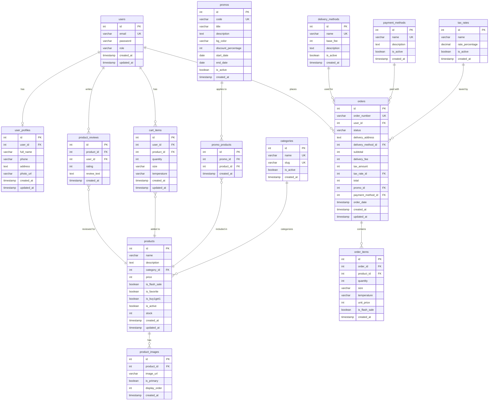

# Coffee Shop Backend

REST API untuk sistem manajemen coffee shop yang dibangun dengan Go (Golang), Gin Framework, dan PostgreSQL.

## Entity Relationship Diagram (ERD)



## Fitur

- **Autentikasi & Otorisasi**
  - Register & Login
  - JWT Token
  - Role-based access (Admin & Customer)
  
- **Manajemen User**
  - CRUD User (Admin)
  - Update Profile
  - Upload Profile Photo
  - Change Password

- **Manajemen Produk**
  - CRUD Produk (Admin)
  - List Produk & Kategori (Public)
  - Pagination

- **Manajemen Order**
  - Create Order (Customer)
  - View & Update Order Status (Admin)
  - Dashboard Statistics (Admin)

## Tech Stack

- **Backend**: Golang + Gin Framework
- **Database**: PostgreSQL
- **Authentication**: JWT
- **Password Hashing**: Argon2
- **API Documentation**: Swagger


## Endpoints

### Public Endpoints
- `POST /auth/register` - Register user baru
- `POST /auth/login` - Login user
- `GET /categories` - List kategori
- `GET /products` - List produk
- `GET /products/:id` - Detail produk

### Authenticated Endpoints (Customer)
- `GET /auth/profile` - Get profile
- `PATCH /auth/profile` - Update profile
- `POST /auth/profile/photo` - Upload profile photo
- `POST /auth/change-password` - Change password
- `POST /orders` - Create order

### Admin Endpoints
- `GET /admin/dashboard` - Dashboard statistics
- `GET /admin/users` - List users
- `POST /admin/users` - Create user
- `PATCH /admin/users/:id` - Update user
- `DELETE /admin/users/:id` - Delete user
- `POST /admin/products` - Create product
- `PATCH /admin/products/:id` - Update product
- `DELETE /admin/products/:id` - Delete product
- `GET /admin/orders` - List orders
- `GET /admin/orders/:id` - Detail order
- `PATCH /admin/orders/:id/status` - Update order status

## Authentication

Semua endpoint yang memerlukan autentikasi harus menyertakan JWT token di header:

```
Authorization: Bearer <your_token_here>
```

## Project Structure

```
coffee-shop/
├── controllers/        # Request handlers
├── middleware/         # Middleware (Auth, CORS)
├── models/            # Data models & database
├── routes/            # Route definitions
├── uploads/           # Upload directory
├── docs/              # Swagger documentation
├── main.go            # Entry point
└── .env               # Environment variables
```

## Response Format

### Success Response
```json
{
  "success": true,
  "message": "Success message",
  "data": {}
}
```

### Error Response
```json
{
  "success": false,
  "message": "Error message"
}
```

### Pagination Response
```json
{
  "success": true,
  "message": "Data retrieved",
  "data": [],
  "meta": {
    "page": 1,
    "limit": 10,
    "total_items": 50,
    "total_pages": 5
  }
}
```
